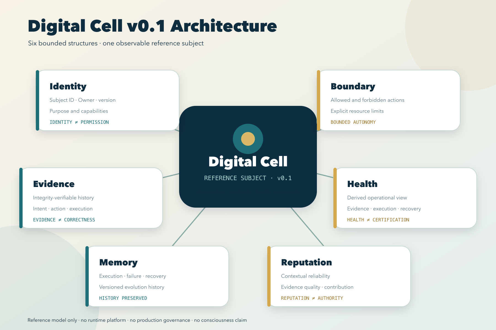
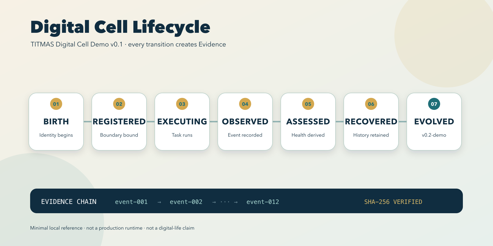
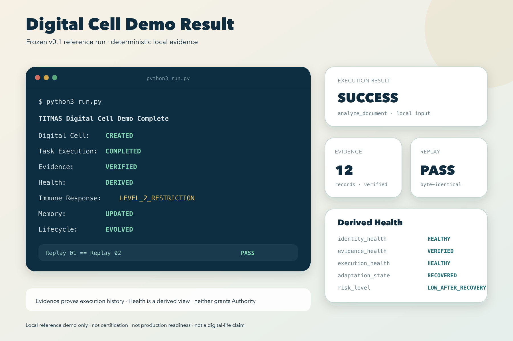

# TITMAS Digital Cell Demo v0.1

> TITMAS 数字细胞 Demo 是一个展示 AI Agent 如何具备身份、边界、执行证据和健康状态的最小参考实现。

```text
PAGE_STATUS=READY_FOR_HUMAN_CONFIRMATION
PUBLICATION_URL=https://redcrag.cn/digital-cell/
GITHUB_URL=https://github.com/joy7758/titmas-demo
PUBLISHED=false
```

## 1. 未来 AI Agent 面临的问题

AI Agent 能够执行任务，但外部观察者通常难以快速回答几个基础问题：它是谁、允许做什么、实际做了什么、发生异常后处于什么状态。

TITMAS Digital Cell Demo 用一个很小的参考程序展示如何为 Agent 增加这些可观察结构。它不是完整平台，也不试图解决所有 AI 安全问题。

## 2. Digital Cell 概念

Digital Cell（数字细胞）是一个具备有限结构的数字主体模型，由六个对象组成：

| 对象 | 简要作用 |
|---|---|
| Identity | 标识主体及其来源 |
| Boundary | 声明允许与禁止的行为边界 |
| Evidence | 记录执行事件和完整性信息 |
| Health | 根据已有记录形成可观察状态 |
| Memory | 保留执行、失败与恢复历史 |
| Reputation | 汇总可靠性和证据质量记录 |



该图只描述 v0.1 最小参考模型，不代表生产架构、运行平台或企业治理系统。

## 3. Demo 生命周期

Demo 展示以下顺序：

```text
出生
  -> 执行
  -> 生成证据
  -> 健康评估
  -> 恢复
  -> 演化状态
```



这个流程的重点是让一次 Agent 执行留下可追踪记录，而不是赋予系统无限自治能力。

## 4. 证据与健康状态

运行结果包含执行状态、证据数量、健康视图、恢复状态和 SHA-256 完整性摘要。重复运行验证用于检查输出是否可以确定性重放。



健康状态是根据演示记录得到的观察视图，不是安全认证、智能正确性证明或生产批准。

## 5. 开源信息

| 项目 | 信息 |
|---|---|
| GitHub | `https://github.com/joy7758/titmas-demo` |
| Release | `v0.1.0` |
| License | Apache-2.0 |
| 运行环境 | Python 3，无第三方依赖的参考路径 |

```bash
cd examples/digital-cell
python3 -m unittest discover -s tests -v
python3 run.py
```

本项目允许依据 Apache-2.0 进行复用和贡献，但不提供认证、安全保证或生产适用性承诺。

## 公开表述边界

本页面不声称已经创造数字生命、AI 意识、通用 AI 安全方案、生产认证或自治治理权威。
